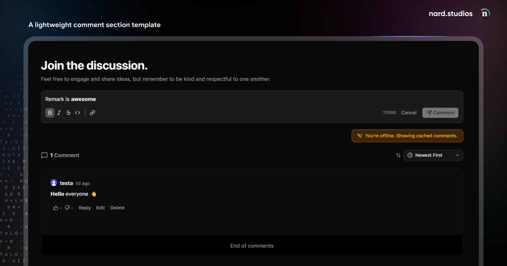

# Remark



A lightweight comment-section template for your apps. Try it [out](https://remark-ui.vercel.app).

Inspired by [Fuma Comment](https://fuma-comment.vercel.app/), powered by Next.js, Clerk, Convex & Fumadocs.

## Installation

First clone the repo and install the dependencies.

```bash
npm install
```

You will need both a Convex and Clerk account. Once acquired, set up a new application on each platform, then get the following API keys.

 ```env
# create a .env.local file and add the following values

NEXT_PUBLIC_CONVEX_URL=https://xxx.convex.cloud        # 1
NEXT_PUBLIC_CLERK_PUBLISHABLE_KEY=pk_test_xxx          # 2

CLERK_SECRET_KEY=sk_test_xxx                           # 3
CLERK_FRONTEND_API_URL=https://xxx.clerk.accounts.dev  # 4

CLERK_WEBHOOK_SECRET=whsec_xxx                         # 5
```

- \#1, \#2 are generated automatically when you run `npx convex dev`
- \#3,\#4 come from your Clerk dashboard. Follow the official Clerk docs [here](https://clerk.com/docs/nextjs/getting-started/quickstart)
- \#5 is for Clerk-Convex webhook, it involves a few extra steps.

<br />

Complete instructions on the [website](https://remark-ui.vercel.app/blog/remark-setup).
